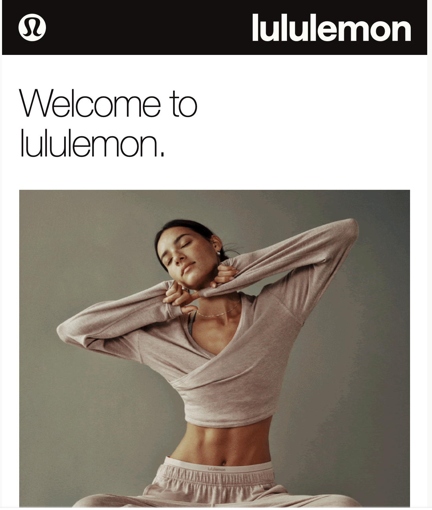
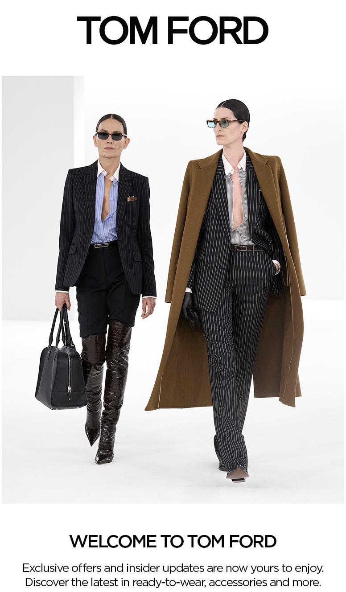
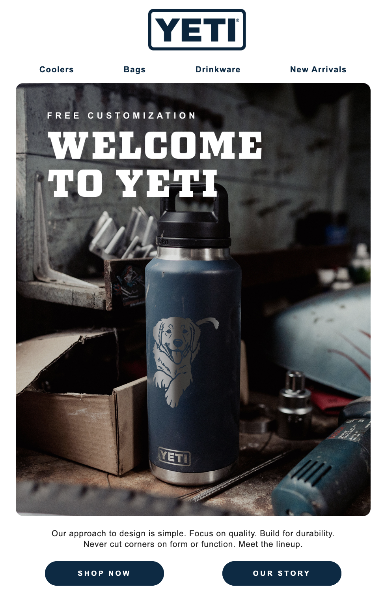
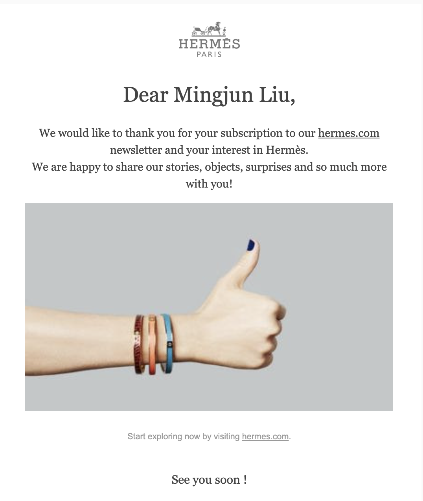

# EDM 案例研究与自动化证据库（Ocoopa / Diveblues）

> 内部研究稿。用于 EDM 专项启动前的案例学习、视觉呈现和自动化论证。截图来自用户实际订阅后的 inbox 观察；公开链接用于补充可追溯来源。外部品牌策略判断若不能由公开来源或用户截图支持，均标为 `to-source` 或 `low-confidence inference`。

## 1. Executive Summary

这轮案例研究得到四个明确结论：

1. **Welcome Email 是最低成本的正反馈机制。** 用户刚订阅后立即收到品牌回应，会确认“订阅动作有效”，同时建立品牌第一印象。Ocoopa / Diveblues 当前没有任何默认 automation、弃购邮件或订单邮件，这是一块基础缺口。
2. **好品牌的 welcome 不只是 “Thanks for subscribing”。** lululemon 用大幅人物状态建立品牌世界；Patagonia 用生活场景和口语欢迎建立关系；YETI 同时给导航、品牌价值和 CTA；Hermès / Dior 用极少文字维持高端语气。
3. **视觉强度和文字密度取决于品牌角色。** Luxury 更克制、更像品牌邀请；Outdoor / Lifestyle 更强调真实场景和产品使用；SaaS / 工具品牌更重视连续教育、feature onboarding 和 use-case nurturing。
4. **Ocoopa / Diveblues 应先搭三条基础自动化。** Welcome Flow、Abandoned Cart、Post-Purchase 是优先级最高的 lifecycle 结构。后续再加入 preference / quiz、browse interest、winback。

对 Ocoopa 的迁移方向：

- Welcome 不应只发折扣，应先建立“随身温暖、默契松弛、真实生活里的小冷感”。
- 视觉可以学习 YETI 的产品嵌入场景、Patagonia 的真实生活关系、Dior / Hermès 的礼赠克制感。

对 Diveblues 的迁移方向：

- Welcome 应建立“清凉、干净、移动、生活参与者”的第一印象。
- 视觉可以学习 lululemon 的身体状态、adidas 的运动 / drop 节奏、Manychat / Metricool 的连续教育逻辑。

## 2. 研究边界与来源等级

### 2.1 来源等级

| 等级 | 含义 | 本文用法 |
|---|---|---|
| `user-observed evidence` | 用户实际订阅后收到的邮件截图 | 可用于内部呈现、视觉拆解、welcome 触发证据；不作为公开网页引用 |
| `public URL cited` | 品牌官网、平台官方文档、公开邮件图库 / archive / blog | 可作为正式 source index |
| `to-source` | 需要继续找公开 URL、HTML、邮件原文或用户截图 | 不写成确定事实 |
| `low-confidence inference` | 基于截图或公开材料的合理推断，但没有完整 flow 证据 | 必须显式标注 |

### 2.2 已确认输入

- 用户已实际订阅 LV、adidas、Manychat、Metricool、Hermès、Dior、lululemon、Balenciaga、YETI、Patagonia 等品牌，用于观察 welcome flow。
- 用户提供 6 张 welcome / newsletter 截图：lululemon、Patagonia、Tom Ford、YETI、Hermès、Dior。
- Ocoopa / Diveblues Shopify 后台当前没有任何默认 automation、弃购邮件或订单邮件。
- 后续正式研究需要截图型视觉页面和文字拆解。

### 2.3 仍需补充的证据

- 每封 welcome 邮件的触发时间戳。
- 每个品牌后续第 2、3、4 封 welcome / newsletter 的数量、间隔和主题。
- LV、adidas、Manychat、Metricool、Balenciaga 的 inbox 截图或邮件原文。
- 如果要做“公开可引用”版本，需要尽量用公开 archive / 品牌页面替代私人 inbox 截图。

## 3. 截图型视觉页

### 3.1 lululemon - Welcome to lululemon



**证据等级:** `user-observed evidence`

视觉与结构观察：

- 顶部黑底 logo + wordmark，品牌识别强。
- 大字号标题 “Welcome to lululemon.”，几乎不解释，先建立品牌进入感。
- 第一屏用人物状态和服装材质建立“身体、运动、日常状态”的语境。
- 留白很大，文字少，视觉优先。

可借鉴：

- Diveblues welcome 可用“人物状态 + 生活移动感”建立品牌第一印象，而不是先讲风扇参数。
- Ocoopa 可借用“舒展、身体状态、安静时刻”的大图方式，但色温应更暖。

### 3.2 Patagonia - Welcome


**证据等级:** `user-observed evidence`

视觉与结构观察：

- 大幅真实户外生活场景，logo 放在天空留白区域。
- “Welcome!” 直接压在场景图底部，第一屏就是品牌世界。
- 正文口吻非常口语：“Thanks for signing up... hanging out with you.”
- 它不是用产品开场，而是用共同生活方式和关系感开场。

可借鉴：

- Ocoopa 的 welcome 可以从“我们以后会陪你度过哪些冷的生活瞬间”切入。
- Diveblues 的 welcome 可以从“出门、旅行、户外、朋友”这类参与场景切入。

### 3.3 Tom Ford - Welcome to Tom Ford



**证据等级:** `user-observed evidence`

视觉与结构观察：

- 顶部极强 logo，黑白为主。
- 主视觉是 runway / fashion campaign 人物，几乎不解释。
- 标题 “WELCOME TO TOM FORD”，正文强调 exclusive offers 和 insider updates。
- 欢迎邮件同时承担“加入内部圈层”的身份感。

可借鉴：

- Ocoopa / Diveblues 不适合直接复制高冷语气，但可以学习“订阅后获得 insider updates / first look / early access”的归属感。

### 3.4 YETI - Welcome to YETI



**证据等级:** `user-observed evidence`

视觉与结构观察：

- 顶部有产品分类导航：Coolers、Bags、Drinkware、New Arrivals。
- Hero 图直接把产品放进真实工作台 / 工具场景。
- 文案强调 quality、durability、form、function。
- 双 CTA：`SHOP NOW` 和 `OUR STORY`，同时承接转化与品牌认识。
- “Free customization” 作为上方利益点，给 welcome 一个即时行动理由。

可借鉴：

- Ocoopa welcome 可以采用“双 CTA”：`Shop portable warmth` + `Our story`。
- Diveblues welcome 可以加入分类导航或 use-case 入口，比如 Travel / Commute / Outdoor / Festival。
- YETI 证明功能型产品也可以通过真实场景和品牌信念表达，而不是参数表。

### 3.5 Hermès - Newsletter Subscription



**证据等级:** `user-observed evidence`

视觉与结构观察：

- 灰白背景、居中排版、logo 很克制。
- 直接称呼用户姓名，语气正式。
- 文案关键词是 stories、objects、surprises，而不是促销。
- 图片是单个物件 / 手部细节，极简且留白大。
- CTA 不是按钮，而是文本链接 `hermes.com`。

可借鉴：

- Ocoopa 礼赠 / 高质感品牌内容邮件可以学习 Hermès 的“物件 + 故事 + 留白”。
- Diveblues 不必用这种正式语气，但可学习“少即是多”的信息克制。

### 3.6 Dior - Go Behind the Scenes


**证据等级:** `user-observed evidence`

视觉与结构观察：

- logo 占据顶部视觉中心。
- 主图是高识别度礼盒与人物造型，强化奢侈品牌礼赠感。
- 标题是 `GO BEHIND THE SCENES OF THE HOUSE OF DIOR`，欢迎邮件被包装成进入品牌幕后。
- 正文非常短：感谢注册、欢迎购物、署名 Dior Online Boutique。

可借鉴：

- Ocoopa 节日 gifting 邮件可以借鉴“礼盒 / 开箱 / behind the scenes”的高质感表达。
- Diveblues 如果做品牌发布或新品幕后，可学习“品牌世界入口”而不是直接产品促销。

## 4. 品牌案例地图

| Brand | 类型 | 当前证据 | 重点学习 | 迁移到 Ocoopa / Diveblues |
|---|---|---|---|---|
| Louis Vuitton | Luxury | 用户已订阅；截图待补；公开官网 / archive 待补 | 品牌世界、系列感、campaign visual | 学“高质感少字”，用于 Ocoopa 礼赠和品牌内容 |
| Hermès | Luxury | 用户截图 | 克制、物件叙事、stories / objects | Ocoopa 礼赠和高端物件感 |
| Dior | Luxury | 用户截图 | 礼盒、behind the scenes、品牌幕后 | Ocoopa holiday gifting、品牌幕后 |
| Tom Ford | Fashion luxury | 用户截图 | insider updates、强 logo、fashion attitude | 学订阅后的“圈层感” |
| Balenciaga | Fashion luxury | 用户已订阅；截图待补；公开官网 / archive 待补 | 视觉态度、反常规、少解释 | 只可谨慎迁移视觉态度，不适合 Ocoopa 大量照搬 |
| lululemon | Lifestyle performance | 用户截图 | 身体状态、routine、社区感 | Diveblues lifestyle / movement welcome |
| adidas | Performance / sports | 用户已订阅；截图待补；公开官网 / archive 待补 | drop、member、运动场景、event | Diveblues 世界杯 / fan / performance 场景 |
| Patagonia | Outdoor / mission | 用户截图 | 真实户外场景、使命与关系感 | Ocoopa / Diveblues 品牌价值邮件 |
| YETI | Outdoor / rugged lifestyle | 用户截图 | 功能产品的场景化、双 CTA、耐用价值 | Ocoopa outdoor / Diveblues portable use-case |
| Manychat | SaaS / creator tool | 用户已订阅；截图待补；官方资源可补 | onboarding、教育流、use-case nurturing | 学自动化教育逻辑，不学视觉 |
| Metricool | SaaS / social tool | 用户已订阅；截图待补；官方 blog 可补 | 周期性内容、工具教育、社媒知识 | 学 newsletter 连续价值 |

## 5. 逐品牌文字拆解

### 5.1 Louis Vuitton

**证据状态:** `to-source`。用户已订阅，但本轮未提供截图。

拟研究方向：

- Luxury newsletter 通常不是先讲优惠，而是让用户进入 collection、campaign、craft、gift guide 等品牌世界。
- LV 对 Ocoopa 的价值不是学奢侈价格感，而是学“产品不急着卖，先让视觉和品牌系统成立”。

可迁移：

- Ocoopa holiday gifting 邮件可以减少参数与折扣信息，把“礼物被看见、被包装、被送出”的仪式感提前。
- Diveblues 不建议学 LV 的距离感，但可学 campaign consistency。

待补：

- welcome 邮件截图。
- 第 2 封 / 第 3 封 newsletter 主题。
- 是否有 preference / country / category collection 入口。

### 5.2 Hermès

**证据状态:** `user-observed evidence`

核心学习：

- Welcome 文案把订阅定义成“share our stories, objects, surprises”，不是促销订阅。
- 视觉用手部 + 手镯细节传达物件与工艺。
- CTA 弱化为文本链接，保持高端克制。

迁移：

- Ocoopa: “portable warmth object” 可以学习 Hermès 的物件叙事。不要每封都写“暖手宝”，可以写“a small object you keep close”。
- Diveblues: 可以学习视觉留白，但语气要更轻、更动态。

### 5.3 Dior

**证据状态:** `user-observed evidence`

核心学习：

- Welcome 被设计成进入 “House of Dior” 的 backstage。
- 礼盒主视觉立刻强化 gifting 与 premium unboxing。
- 个性化称呼用户姓名，但正文保持短。

迁移：

- Ocoopa: 圣诞 / 母亲节 / holiday gifting 邮件可借“behind the scenes / gift box / opening moment”。
- Diveblues: 新品发布可做“behind the scenes of the drop”，但色温与动态要更清凉。

### 5.4 Tom Ford

**证据状态:** `user-observed evidence`

核心学习：

- Welcome 强调 exclusive offers and insider updates。
- 订阅被包装成“加入内部更新”，不是普通广告。
- Logo 与 campaign 人物强势，信息极少。

迁移：

- Ocoopa / Diveblues 可将 welcome 的价值写成 first access、early looks、useful drops，而不只是折扣。

### 5.5 Balenciaga

**证据状态:** `to-source`。用户已订阅，但本轮未提供截图。

拟研究方向：

- 强视觉、反常规、少解释。
- 对 Ocoopa / Diveblues 的可迁移价值主要是“品牌态度先行”的视觉决心。

迁移边界：

- Ocoopa / Diveblues 不适合直接照搬冷感、疏离或过度 fashion 的表达。
- 可借“强主视觉 + 极少文字”，用于新品 teaser 或 campaign launch。

### 5.6 lululemon

**证据状态:** `user-observed evidence`

核心学习：

- Welcome 直接把用户带入“身体状态”和“日常运动感”。
- 大标题非常简单，没有促销噪音。
- 品牌视觉像 lifestyle editorial，而不是商品导购。

迁移：

- Diveblues welcome 第一封可以用人物正在出门、移动、旅行、通勤的画面，不先讲参数。
- Ocoopa 可以用身体放松、手部触感、安静时刻来建立“被温暖照顾”的身体状态。

### 5.7 adidas

**证据状态:** `to-source`。用户已订阅，但本轮未提供截图。

拟研究方向：

- 运动品牌常见邮件逻辑：drop / launch、membership、event、product collection、athlete / culture。
- 对 Diveblues 特别有用，因为 Diveblues 可承接世界杯、户外、演唱会、运动场景。

迁移：

- Diveblues 可以设置 fan event / match day / summer movement 的专题 newsletter。
- Ocoopa 可以参考会员 / early access 机制，但不宜过运动化。

### 5.8 Patagonia

**证据状态:** `user-observed evidence`

核心学习：

- Welcome 是场景和关系，而不是产品列表。
- 文案非常口语：“hanging out with you”。
- Patagonia 的品牌世界通过真实户外、朋友关系和自然景观建立。

迁移：

- Ocoopa: “Thanks for signing up” 可以改成更有人味的欢迎，不必像系统通知。
- Diveblues: 户外 / 旅行 / 朋友场景要让用户成为参与者，不只是旁观者。

### 5.9 YETI

**证据状态:** `user-observed evidence`

核心学习：

- 功能型产品也能做出强品牌感。
- 顶部导航给用户快速分流。
- Hero 图不是白底产品，而是真实使用环境。
- 双 CTA 同时服务转化与品牌理解。

迁移：

- Ocoopa: Welcome 可放 “Shop now” + “Our story”，既承接 Shopify 转化，也补品牌认知。
- Diveblues: 顶部模块可按 Travel / Commute / Outdoor / New Arrivals 分流。

### 5.10 Manychat

**证据状态:** `to-source`。用户已订阅，但本轮未提供截图；可用官方 blog / resource 做补充。

拟研究方向：

- SaaS welcome / onboarding 重点通常是让用户完成下一步动作，而不是“看品牌大片”。
- 可能包含教程、use case、模板、webinar、feature education。

迁移：

- Ocoopa / Diveblues 的 post-purchase 邮件可学习 SaaS onboarding：买完后不是结束，而是引导“怎么用、何时用、下一步做什么”。

### 5.11 Metricool

**证据状态:** `to-source`。用户已订阅，但本轮未提供截图；官方 blog 可补内容节奏。

拟研究方向：

- 内容型 newsletter 的价值在连续提供知识，而不是每封都转化。
- 对 EDM 专项的价值是学习“长期栏目化”：weekly tips、platform updates、best practices。

迁移：

- Ocoopa 可做 winter comfort tips、gift guide、commute cold moments。
- Diveblues 可做 summer / travel / event / fan场景 tips。

### 5.12 扩展案例池：后续可继续深挖

以下品牌不替代用户已订阅品牌的拆解，只作为后续扩充案例库的候选，用于补足不同风格的学习样本。

| Brand | Why it matters | What to learn | Source status |
|---|---|---|---|
| Aesop | 克制、编辑化、文字质感强，适合学习“品牌哲学 + 产品物件” | Ocoopa 品牌内容邮件、礼赠邮件的高级克制感 | to-source; official / email archive needed |
| Arc'teryx | 高性能户外与极简视觉结合 | Diveblues / Ocoopa 如何讲功能但不堆参数 | to-source; official / email archive needed |
| On | 运动科技、跑步生活方式、简洁转化链路 | Diveblues 运动 / 通勤 / 城市场景 | to-source; official / email archive needed |
| REI | 户外零售、教育内容、社群活动、gear guide | Ocoopa / Diveblues 场景教育和选购指南 | to-source; official / email archive needed |
| Notion / Canva / Figma | SaaS / 工具品牌常见 onboarding、模板、use-case 教育 | Post-purchase 教育流、preference / use-case nurturing | to-source; official resources / email screenshots needed |

## 6. EDM 自动化案例与文献

### 6.1 为什么 welcome automation 必须先做

用户完成 newsletter signup 后，如果没有任何自动回应，订阅动作在体验上是“悬空”的。Welcome automation 至少完成三件事：

1. 确认订阅成功。
2. 建立第一印象。
3. 把用户带入下一步：品牌故事、偏好、best sellers、首购、社媒、使用场景。

平台与行业来源给出的共同方向：

- Shopify 将 email automation 定义为根据用户行为触发的邮件，可用于 welcome、abandoned checkout、post-purchase 等场景。
- Klaviyo 和 Omnisend 的 welcome series 指南都把 welcome 作为新订阅用户进入品牌关系的基础 flow。
- Omnisend 的 automation examples 明确把 welcome、cart abandonment、browse abandonment、post-purchase 等作为 ecommerce lifecycle 自动化类型。

### 6.2 Ocoopa / Diveblues 当前差距

当前确认状态：

- Ocoopa / Diveblues Shopify 后台没有任何默认 automation。
- 没有 welcome email。
- 没有 abandoned cart / abandoned checkout 邮件。
- 没有 post-purchase lifecycle 邮件。
- 没有通过 preference / quiz / click behavior 建立分群标签。

这意味着当前 EDM 主要停留在 campaign 群发层，尚未建立 lifecycle asset。

### 6.3 推荐优先级

| 优先级 | Flow | 为什么先做 | 目标 |
|---|---|---|---|
| P0 | Welcome Flow | 新订阅立即正反馈；建立品牌第一印象 | 激活订阅、偏好收集、首购引导 |
| P0 | Abandoned Cart / Checkout | 用户已接近购买；最直接的转化恢复 | 降低犹豫、召回购物车 |
| P1 | Post-Purchase | 购买后教育、评价、复购、UGC | 提升体验、沉淀 review / UGC |
| P1 | Preference Collection | 为分群打基础 | 场景、用途、礼赠 / 自用、颜色偏好 |
| P2 | Browse / Product Interest | 需要平台和数据支持 | 根据浏览意图做更精准触达 |
| P2 | Winback / Re-engagement | 需要历史数据和名单分层 | 唤回低活跃 / 旧客 |

### 6.4 文献支持

| Literature | What it supports | How to use in EDM project |
|---|---|---|
| Goic, Rojas & Saavedra, “The Effectiveness of Triggered Email Marketing in Addressing Browse Abandonments”, Journal of Interactive Marketing, 2021. DOI: https://doi.org/10.1016/j.intmar.2021.02.002 | triggered emails 是根据用户动作 / 状态自动发送的个性化邮件；研究以 browse abandonment 邮件做实验评估。 | 支撑 Ocoopa / Diveblues 后续从群发走向 browse / cart / post-purchase 自动化。 |
| Sahni, Wheeler & Chintagunta, “Personalization in Email Marketing: The Role of Noninformative Advertising Content”, Marketing Science, 2018. DOI: https://doi.org/10.1287/mksc.2017.1066 | 大规模 field experiments 评估 subject line / recipient name 等个性化元素对打开、leads、退订等行为的影响。 | 支撑 Welcome Flow 中个性化称呼、偏好收集、分群内容的必要性。 |
| Ansari & Mela, “E-Customization”, Journal of Marketing Research, 2003. DOI: https://doi.org/10.1509/jmkr.40.2.131.19224 | permission-based email 中，基于 clickstream 的内容定制可提升点击预期。 | 支撑后续用点击和浏览行为沉淀分群标签，而不是对全名单发同一封。 |

注意：以上文献用于论证“自动化 / 个性化 / 触发式邮件有理论和实证依据”，不能直接换算成 Ocoopa / Diveblues 的预期提升数字。

## 7. 建议优先搭建的自动化 flow

### 7.1 Ocoopa Welcome Flow v1

目标：从“订阅成功”变成“进入随身温暖品牌世界”。

| Email | 触发 | 主题任务 | 内容结构 | CTA |
|---|---|---|---|---|
| Welcome 1 | Signup 后立即 | 建立品牌第一印象 | 暖系生活图 + “small cold moments” + 订阅确认 | `Shop portable warmth` / `Our story` |
| Welcome 2 | D2-D3 | 场景教育 | 通勤、办公室、旅行等待、礼赠四个入口 | `Find your moment` |
| Welcome 3 | D5-D7 | 首购 / best sellers | best sellers + review / UGC + 可选首购激励 | `Shop best sellers` |

Ocoopa 视觉参考：

- Patagonia 的真实关系感。
- YETI 的产品在场景中出现。
- Dior / Hermès 的礼赠克制感。

### 7.2 Diveblues Welcome Flow v1

目标：从“订阅成功”变成“进入清凉、移动、生活参与者品牌世界”。

| Email | 触发 | 主题任务 | 内容结构 | CTA |
|---|---|---|---|---|
| Welcome 1 | Signup 后立即 | 建立清凉生活参与感 | 人物移动 / 旅行 / 出街大图 + 简短欢迎 | `Explore the lineup` |
| Welcome 2 | D2-D3 | 偏好收集 | Travel / Commute / Outdoor / Festival / Family 场景入口 | `Pick your scene` |
| Welcome 3 | D5-D7 | 产品选择 | product finder + color / use-case 分流 | `Find your fit` |

Diveblues 视觉参考：

- lululemon 的人物状态。
- Patagonia 的朋友 / 户外真实关系。
- adidas 的活动和运动场景节奏。

### 7.3 Abandoned Cart v1

| Email | 触发 | 内容任务 | CTA |
|---|---|---|---|
| Cart 1 | abandon 后数小时 | 温和提醒 + 产品图 + 回到购物车 | `Return to cart` |
| Cart 2 | D1 | UGC / review / guarantee / shipping | `Finish your order` |
| Cart 3 | D2-D3 | 可选激励或 urgency，避免过早折扣依赖 | `Complete checkout` |

### 7.4 Post-Purchase v1

| Email | 触发 | Ocoopa 内容 | Diveblues 内容 |
|---|---|---|---|
| Order follow-up | purchase 后 | 购买确认以外的品牌感谢 | 购买确认以外的品牌感谢 |
| Education | D3-D7 | 如何在通勤 / 办公室 / 旅行中使用 | 如何在旅行 / 出街 / 户外中携带 |
| Review / UGC | D10-D14 | 分享你的 warm moment | 分享你的 cool / on-the-go moment |
| Cross-sell | D21+ | 礼赠 / 配件 / 第二件 | 多场景 / 多颜色 / 旅行搭配 |

## 8. Ocoopa 可迁移做法

1. Welcome 视觉不要先做白底产品图。先做一个“需要温暖的真实场景”。
2. Copy 口吻可以像 Patagonia 一样更有人味：欢迎用户进入一个长期关系。
3. 学 YETI 的双 CTA：一个转化，一个品牌故事。
4. 礼赠邮件学习 Dior / Hermès 的克制、高质感、物件叙事。
5. Post-purchase 不只是物流通知，要变成使用教育和 UGC 采集。

## 9. Diveblues 可迁移做法

1. Welcome 视觉学习 lululemon：人物状态和身体参与感先行。
2. 场景入口用 Travel / Commute / Outdoor / Festival / Family，而不是参数分类。
3. 学 adidas 的活动 / drop 节奏，用在世界杯、体育赛事、演唱会、夏季出行。
4. 学 SaaS onboarding 的连续教育：买后教用户怎么用、怎么带、何时用。
5. 不要用 Ocoopa 的暖系礼赠语气，保持清凉、明亮、移动。

## 10. 后续资料收集建议

### 10.1 用户 inbox 继续补充

建议继续下载 / 截图：

- LV welcome / newsletter 第 1-3 封。
- adidas welcome / member / drop 邮件。
- Manychat welcome / onboarding / education 邮件。
- Metricool welcome / newsletter 邮件。
- Balenciaga welcome / campaign 邮件。

命名建议：

```text
YYYY-MM-DD-brand-flow-sequence-topic.png
```

示例：

```text
2026-06-11-lululemon-welcome-01.png
2026-06-12-yeti-welcome-02-customization.png
```

### 10.2 每封邮件记录表

| Brand | Flow | Sequence | Received Time | Subject | Preview Text | Main Visual | CTA | Notes | Evidence |
|---|---|---:|---|---|---|---|---|---|---|
| lululemon | Welcome | 1 | Missing Context | Missing Context | Missing Context | 人物状态 + 大标题 | Missing Context | 截图可见首屏 | user screenshot |

### 10.3 优先获取原始 HTML 或 preview link

截图适合视觉呈现，但不适合精确还原：

- subject
- preview text
- link structure
- CTA tracking
- hidden modules
- mobile / desktop responsive behavior

如果能拿到邮件 HTML、view-in-browser link 或平台 preview link，后续拆解质量会明显更高。

## 11. To-Source / Need User Evidence

| Item | Status | Needed |
|---|---|---|
| LV welcome flow | to-source | 用户截图或公开 archive |
| adidas welcome / member flow | to-source | 用户截图或公开 archive |
| Manychat onboarding sequence | to-source | 用户截图或官方 email example |
| Metricool newsletter sequence | to-source | 用户截图或官方 email example |
| Balenciaga welcome / campaign email | to-source | 用户截图或公开 archive |
| 触发速度 | Missing Context | 邮件收件时间戳 |
| 每个品牌邮件数量 | Missing Context | 连续 7-14 天 inbox 观察 |
| Ocoopa / Diveblues Shopify automation feasibility | to-source | 后台功能确认、Shopify plan / app stack |

## 12. Source Index

### User-Observed Evidence

- `assets/2026-06-11-edm-case-research/lululemon-welcome.png`
- `assets/2026-06-11-edm-case-research/patagonia-welcome.png`
- `assets/2026-06-11-edm-case-research/tom-ford-welcome.png`
- `assets/2026-06-11-edm-case-research/yeti-welcome.png`
- `assets/2026-06-11-edm-case-research/hermes-welcome.png`
- `assets/2026-06-11-edm-case-research/dior-welcome.png`

### Existing Vault Sources

- `/Users/mingjunliu/ai-marketing-wiki/wiki/edm/EDM专项工作方案.md`
- `/Users/mingjunliu/ai-marketing-wiki/wiki/edm/edm-fundamentals.md`
- `/Users/mingjunliu/ai-marketing-wiki/wiki/edm/benchmark-brands.md`
- `/Users/mingjunliu/ai-marketing-wiki/outputs/edm/standards/2026-06-10-edm-copy-standards-v1.md`
- `/Users/mingjunliu/ai-marketing-wiki/outputs/edm/standards/2026-06-10-edm-visual-brief-v1.md`

### Public URL Sources

- Email Love email gallery: https://emaillove.com/
- Really Good Emails: https://reallygoodemails.com/
- Milled email archive: https://milled.com/
- MailCharts email examples: https://www.mailcharts.com/email-examples
- Omnisend email automation examples: https://www.omnisend.com/blog/email-automation-examples/
- Omnisend welcome email series: https://www.omnisend.com/blog/welcome-email-series/
- Mailchimp customer journey builder: https://mailchimp.com/features/customer-journey-builder/
- Shopify Help Center: https://help.shopify.com/
- Klaviyo Help Center: https://help.klaviyo.com/
- Goic, Rojas & Saavedra, triggered email marketing / browse abandonment DOI: https://doi.org/10.1016/j.intmar.2021.02.002
- Sahni, Wheeler & Chintagunta, personalization in email marketing DOI: https://doi.org/10.1287/mksc.2017.1066
- Ansari & Mela, E-Customization DOI: https://doi.org/10.1509/jmkr.40.2.131.19224
- Patagonia official site: https://www.patagonia.com/
- YETI official site: https://www.yeti.com/
- lululemon official site: https://shop.lululemon.com/
- adidas official site: https://www.adidas.com/
- Dior official site: https://www.dior.com/
- Louis Vuitton official site: https://www.louisvuitton.com/
- Hermès official site: https://www.hermes.com/
- Balenciaga official site: https://www.balenciaga.com/
- Tom Ford official site: https://www.tomfordfashion.com/
- Manychat official blog: https://manychat.com/blog/
- Metricool official blog: https://metricool.com/blog/
- Aesop official site: https://www.aesop.com/
- Arc'teryx official site: https://arcteryx.com/
- On official site: https://www.on.com/
- REI official site: https://www.rei.com/
- Notion official site: https://www.notion.com/
- Canva official site: https://www.canva.com/
- Figma official site: https://www.figma.com/
